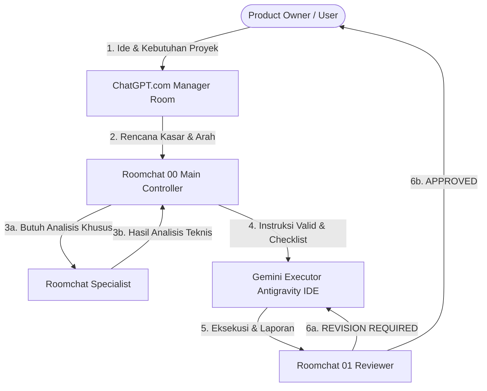

# Alur Komunikasi Antar Ruang (Room Flow)

Dokumen ini menjelaskan alur kerja terstruktur yang direkomendasikan saat menggunakan sistem pembagian ruang chat AI (Room System) dalam proyek **Tien's Catering (TC)**.

## Langkah Alur Pengerjaan

### 1. User & Manager Room
- **Aksi**: User berdiskusi di **ChatGPT.com / Manager Room** untuk merumuskan ide fitur baru, perbaikan, atau perubahan arah bisnis.
- **Output**: Manager Room menyusun draf rencana kerja awal yang ramah asisten AI.

### 2. Evaluasi di Roomchat 00
- **Aksi**: Draf dari Manager Room disalin oleh User ke **Roomchat 00 (Main Controller)**.
- **Tugas**: Roomchat 00 memverifikasi status proyek saat ini (`Docs/history/CURRENT_STATUS.md`) dan batasan file (Scope / HOLD areas).
- **Keputusan**: Roomchat 00 mengategorikan tugas menjadi `docs-only`, `audit-only`, atau `implementation-ready`, lalu menyusun berkas rencana kerja (`task.md`).

### 3. Eksekusi Teknis di Gemini (Antigravity IDE)
- **Aksi**: Gemini membaca `task.md` dan mulai menulis kode atau memperbarui dokumentasi.
- **Tugas**: Melakukan verifikasi build lokal (`npm run check` atau `npm run dev`) setelah selesai melakukan modifikasi berkas.
- **Output**: Gemini menyerahkan **Executor Report** yang berisi daftar file yang berubah dan kepatuhan batasan.

### 4. Penilaian Kualitas di Roomchat 01
- **Aksi**: User membawa Executor Report beserta perubahan file ke **Roomchat 01 (Reviewer)**.
- **Tugas**: Roomchat 01 memverifikasi apakah ada pelanggaran batasan berkas (HOLD areas), pengujian fungsional yang dilewati, atau salah penulisan status fitur.
- **Keputusan**: 
  - Jika lulus: `APPROVED` (User dipersilakan melakukan `git commit` dan `git push`).
  - Jika tidak: `REVISION REQUIRED` (Gemini harus memperbaiki pekerjaannya sesuai catatan revisi).

---

## Kapan Menggunakan Ruang Tambahan?

### A. Kapan Menggunakan Roomchat Specialist?
- Ketika ada masalah teknis yang sangat spesifik dan kompleks (misal: bagaimana mendesain ulang relasi schema SQLite, merancang sistem role guard di backend, atau mengatasi masalah accessibility di halaman catalog).
- **Hasil**: Laporan dari Specialist diserahkan kembali ke Roomchat 00 untuk diubah menjadi langkah pengerjaan teknis (`task.md`).

### B. Kapan Boleh Langsung ke Gemini (Bypass)?
- Untuk tugas-tugas yang sifatnya sangat sepele dan tidak berisiko (low-risk), seperti:
  - Memperbaiki salah eja (typo) di dokumentasi.
  - Menambahkan baris komentar di dalam kode.
  - Memperbarui file status kecil.
- **Catatan**: Meskipun bypass Room01 diperbolehkan untuk tugas kecil, Gemini Executor tetap harus menulis **Executor Report** untuk menjaga keteraturan.

### C. Kapan Pengerjaan Harus Dihentikan?
- Jika dokumentasi status `CURRENT_STATUS.md` atau database schema dirasa tidak selaras dengan kode nyata di `apps/`.
- **Tindakan**: Hentikan pengerjaan teknis, lalu jalankan tugas **FXX-CP (Documentation Checkpoint)** terlebih dahulu untuk menyinkronkan status sebelum melanjutkan penulisan kode.
